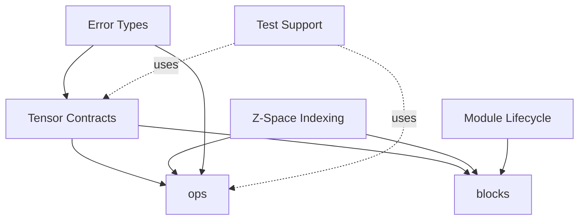

# Concepts Overview

`bunsen` is organized around a few cross-cutting ideas that show up in nearly
every component:

- **[Tensor Contracts](./contracts.md)** &mdash; runtime-checked shape and
  dtype invariants that travel with tensors, replacing brittle ad-hoc
  `assert_eq!` patterns.
- **[Modules and Lifecycle](./modules.md)** &mdash; conventions for building
  `burn::module::Module`s that play well with `bunsen::burner` lifecycle
  utilities.
- **[Z-Space Indexing](./zspace.md)** &mdash; the index/coordinate model used
  for batched and shard-aware tensor work.

Each linked chapter goes into the *why* before the *what*. If you already know
the concept and want the API, jump to the matching
[Components](../components/blocks.md) chapter.
