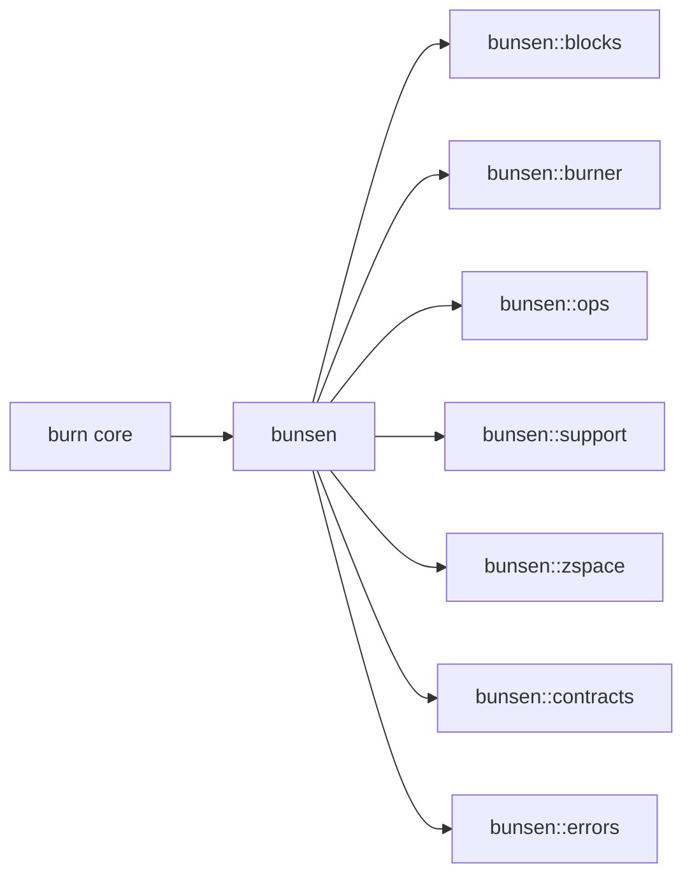

# Introduction

`bunsen` is a *batteries-included* community standard library for the
[`burn`](https://burn.dev) tensor framework. It collects reusable modules,
tensor operations, shape contracts, and lifecycle utilities that fall outside
`burn`'s core scope but are needed by anyone building real models on top of it.

This book is the long-form companion to the
[API docs](https://docs.rs/bunsen). The API docs answer *what is this type?*;
this book answers *why does it exist, when do I reach for it, and how do the
pieces fit together?*

## What's in the library?

A whirlwind tour:

- **[`bunsen::blocks`](./components/blocks.md)** &mdash; reusable `Module`
  implementations: inner layers, recurrent utilities, and full model families.
- **[`bunsen::burner`](./components/burner.md)** &mdash; `Module` lifecycle
  helpers that extend `burn`'s out-of-the-box functionality.
- **[`bunsen::ops`](./components/ops.md)** &mdash; additional `Tensor`
  operations.
- **[`bunsen::support`](./components/support.md)** &mdash; shared support code,
  including testing utilities downstream crates can use.
- **[`bunsen::zspace`](./components/zspace.md)** &mdash; z-space / index
  utilities.
- **[`bunsen::contracts`](./components/contracts.md)** &mdash; runtime
  tensor-shape contracts.
- **[`bunsen::errors`](./components/errors.md)** &mdash; error types and
  diagnostic tooling.

## Why a "standard library"?

The burn ecosystem moves quickly, and individual extension crates tend to drift
out of sync with each release. `bunsen` exists to:

1. Track the `burn` release cycle tightly, so dependent code doesn't have to.
2. Provide a single dependency surface for common building blocks instead of
   a tangle of single-purpose crates.
3. Centralize testing, documentation, and contracts so contributed components
   can be trusted across projects.

## Tensor shapes and math

This book uses KaTeX for math. For example, a linear layer computes

$$
y = x \cdot W^{\top} + b \quad \text{where} \quad x \in \RR^{B \times d_{\text{in}}}.
$$

See [Tensor Contracts](./concepts/contracts.md) for how shapes like
$B \times d_{\text{in}}$ become first-class, machine-checked constraints.

## How to read this book

- New to `bunsen`? Start with [Installation](./getting-started/installation.md)
  and the [Quick Start](./getting-started/quick-start.md).
- Already shipping models on `burn`? Jump to
  [Components](./components/blocks.md) for what each module offers.
- Considering contributing? See the
  [Contributing Guide](./contributing/index.md).
