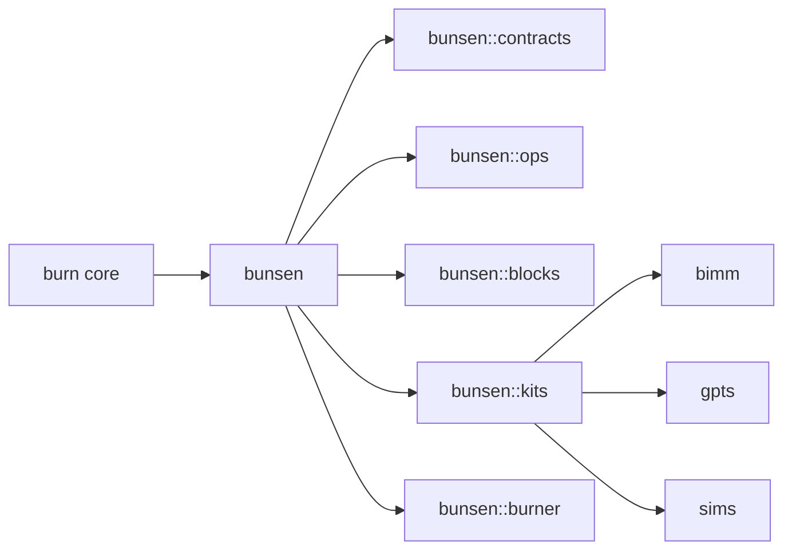

# Introduction

`bunsen` is a *batteries-included* community standard library for the
[`burn`](https://burn.dev) tensor framework. It collects reusable modules,
tensor operations, shape contracts, and lifecycle utilities that fall outside
`burn`'s core scope but are needed by anyone building real models on top of it.

This book is the long-form companion to the
[API docs](https://docs.rs/bunsen). The API docs answer *what is this type?*;
this book answers *why does it exist, when do I reach for it, and how do the
pieces fit together?*

## What's in the library?

A whirlwind tour:

- **[`bunsen::contracts`](./contracts/overview.md)** &mdash; runtime
  tensor-shape contracts: a small DSL that turns paper-style shape
  notation into a runtime check, fast enough to stay enabled in
  release.
- **[`bunsen::ops`](./ops/overview.md)** &mdash; additional `Tensor`
  operations as pure functions: range generators, clamp, dropout,
  noise, RMSNorm, repeat-interleave, and convolution shape arithmetic.
- **[`bunsen::blocks`](./blocks/overview.md)** &mdash; reusable
  `Module` building blocks: attention and rotary embeddings for
  transformers, conv composites / patching / pooling / stochastic
  regularization for image models.
- **[`bunsen::kits`](./kits/bimm.md)** &mdash; complete domain
  implementations built on top of the rest of the crate: image-model
  families ([`bimm`](./kits/bimm.md)), GPT/LLM variants
  ([`gpts`](./kits/gpts.md)), and iterative tensor simulations
  ([`sims`](./kits/sims.md)).
- **[`bunsen::burner`](./burner/overview.md)** &mdash; `burn`-adjacent
  infrastructure: parameter descriptors,
  [module reflection](./burner/module-introspection.md), and the
  [composite optimizer](./burner/composite-optimizers.md) family.

## Why a "standard library"?

The burn ecosystem moves quickly, and individual extension crates tend to drift
out of sync with each release. `bunsen` exists to:

1. Track the `burn` release cycle tightly, so dependent code doesn't have to.
2. Provide a single dependency surface for common building blocks instead of
   a tangle of single-purpose crates.
3. Centralize testing, documentation, and contracts so contributed components
   can be trusted across projects.

## Tensor shapes and math

This book uses KaTeX for math. For example, a linear layer computes

$$
y = x \cdot W^{\top} + b \quad \text{where} \quad x \in \RR^{B \times d_{\text{in}}}.
$$

See [Contracts](./contracts/overview.md) for how shapes like
$B \times d_{\text{in}}$ become first-class, machine-checked constraints.

## How to read this book

- New to `bunsen`? Start with
  [Installation](./getting-started/installation.md) and then the
  [Overview](./getting-started/overview.md) tour.
- Already shipping models on `burn`? Jump to
  [`bunsen::contracts`](./contracts/overview.md),
  [`bunsen::ops`](./ops/overview.md), or
  [`bunsen::blocks`](./blocks/overview.md) for what each layer
  offers.
- Considering contributing? See the
  [Contributing Guide](./contributing/index.md).
